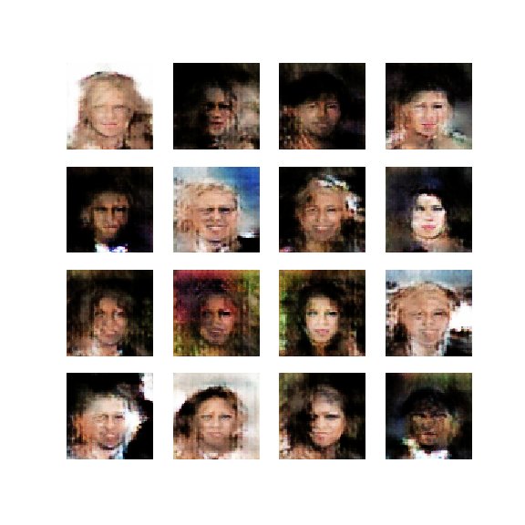
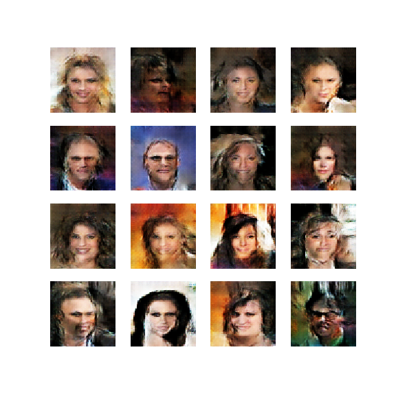
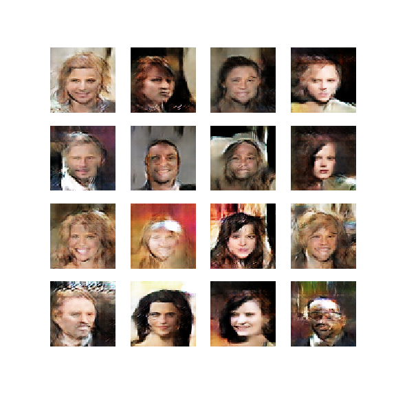
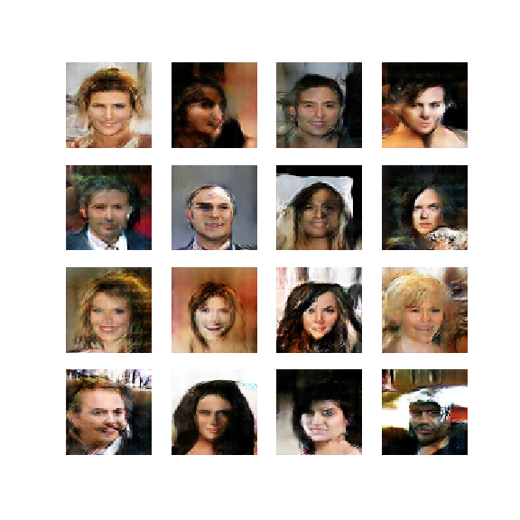
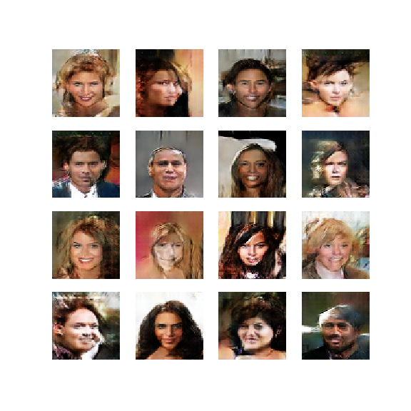
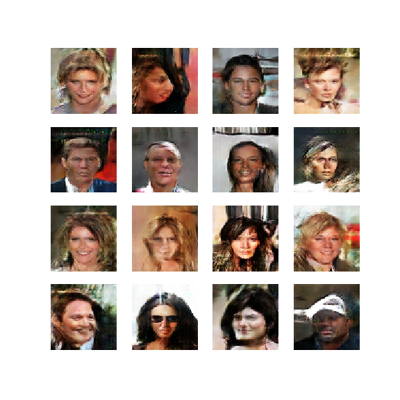
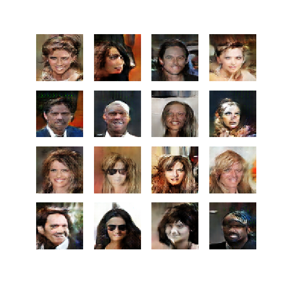
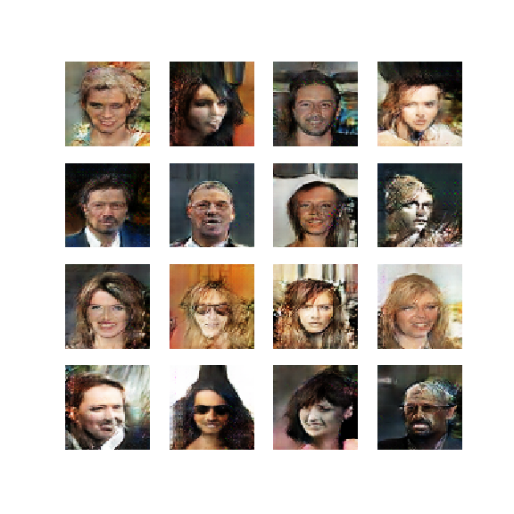
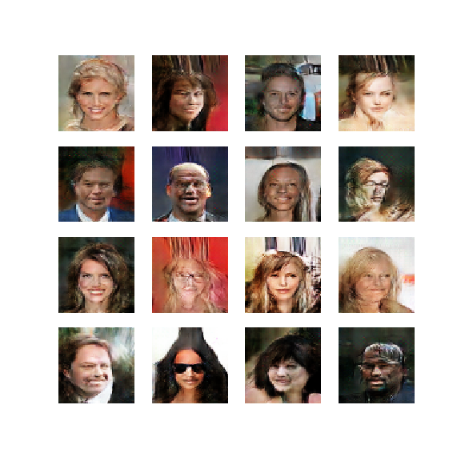
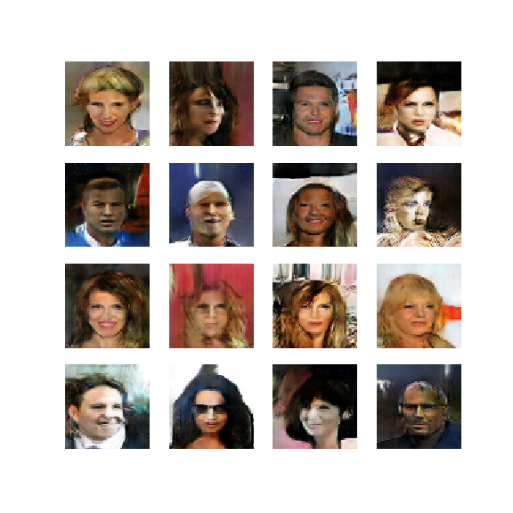

# COSC440 Generative Adversarial Network Assignment
This repository contains the code for my submission for the COSC440 Generative Adversarial Network Assignment with TensorFlow.

## Outputs for first 10 Epochs
### Epoch 1

### Epoch 2

### Epoch 3

### Epoch 4

### Epoch 5

### Epoch 6

### Epoch 7

### Epoch 8

### Epoch 9

### Epoch 10

